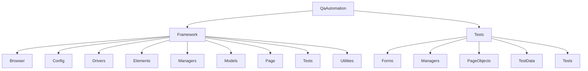

# QaAutomation

## Описание

QaAutomation — проект для автоматизированного UI-тестирования веб-приложения DemoQA.

Проект предназначен для проверки основных пользовательских сценариев с использованием Selenium WebDriver и NUnit.

В проекте автоматизированы следующие сценарии:

* работа с alert, confirm и prompt;
* работа с iframe и nested frames;
* работа с browser windows и вкладками;
* добавление и удаление записей в Web Tables;
* работа с Slider и Progress Bar;
* работа с Date Picker;
* скачивание и загрузка файлов.

## Требования

Для запуска проекта необходимо установить:

* Git;
* .NET SDK 10.0;
* Google Chrome;
* Mozilla Firefox.

Все NuGet-зависимости проекта указаны в `Framework.csproj` и `Tests.csproj` и автоматически восстанавливаются при выполнении `dotnet restore`.

## Установка

### Клонирование репозитория

```bash
git clone https://github.com/zz21m/demoQA_UI_tests.git
```

### Запуск из консоли

Перейти в директорию проекта:

```bash
cd demoQA_UI_tests
```

Восстановить зависимости:

```bash
dotnet restore QaAutomation/Tests/Tests.csproj
```

Для запуска всех автоматизированных тестов выполнить:

```bash
dotnet test QaAutomation/Tests/Tests.csproj
```

### Запуск из IDE

Открыть склонированный репозиторий в IDE.

Открыть solution:

```text
QaAutomation/Tests/Tests.csproj
```

После загрузки проекта запустить тесты через средство запуска тестов IDE.

## Структура проекта



### Framework

* `Browser` — вспомогательные операции с браузером, alert, окнами и iframe;
* `Config` — конфигурация браузеров и общих параметров;
* `Drivers` — создание и настройка WebDriver;
* `Elements` — базовые и специализированные UI-элементы;
* `Managers` — управление конфигурацией;
* `Models` — модели конфигурации;
* `Page` — базовые классы страниц;
* `Tests` — базовая настройка тестов;
* `Utilities` — вспомогательные классы для работы с датами, файлами, JSON, JavaScript, случайными данными и математическими вычислениями.

### Tests

* `Forms` — формы конкретных страниц приложения;
* `Managers` — управление тестовыми данными;
* `PageObjects` — страницы приложения;
* `TestData` — модели и JSON-файлы с тестовыми данными;
* `Tests` — автоматизированные тестовые сценарии.

## Тестовые сценарии

### Alerts

Проверяет работу alert, confirm и prompt:

* открытие alert;
* проверку текста;
* закрытие alert;
* подтверждение confirm;
* ввод случайного текста в prompt;
* проверку результата.

### Iframe

Проверяет работу с iframe и nested frames:

* открытие страницы Nested Frames;
* получение текста из parent frame;
* получение текста из child iframe;
* открытие страницы Frames;
* проверку текста верхнего и нижнего фреймов.

### Handles

Проверяет работу с окнами и вкладками браузера:

* открытие новой вкладки;
* переключение между окнами;
* проверку URL и содержимого страницы;
* закрытие вкладки;
* возврат к предыдущей вкладке.

### Tables

Проверяет работу с Web Tables:

* открытие формы;
* добавление пользователя;
* проверку появления пользователя в таблице;
* удаление пользователя;
* проверку изменения количества записей;
* проверку удаления пользователя.

### SliderProgressBar

Проверяет работу со Slider и Progress Bar:

* получение минимального и максимального значения Slider;
* установка случайного значения;
* проверку установленного значения;
* запуск Progress Bar;
* остановку Progress Bar около заданного значения;
* проверку допустимой погрешности.

### DatePicker

Проверяет работу с Date Picker:

* проверку текущей даты;
* проверку текущей даты и времени;
* выбор ближайшего 29 февраля;
* проверку выбранной даты.

### Files

Проверяет работу со скачиванием и загрузкой файлов:

* очистку директории загрузок;
* скачивание файла;
* ожидание завершения загрузки;
* проверку существования скачанного файла;
* загрузку скачанного файла;
* проверку имени загруженного файла.

## Логи

Лог выполнения автоматизированных тестов сохраняется в файл:

```text
QaAutomation/Tests/bin/Debug/net10.0/Logs/test.log
```
